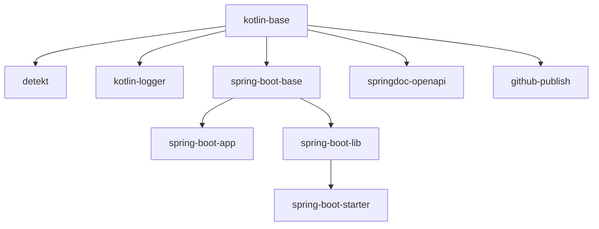

# GCX Common Libs

## Table of Contents

- [Libraries](#libraries)
- [Gradle Plugins](#gradle-plugins)
    - [Plugins Description](#plugins-description)
- [How to add to your project?](#how-to-add-to-your-project)
- [Contributing to the common libs](#contributing-to-the-common-libs)
- [Publishing](#publishing)
- [Projects adopting the GCX Common Libs](#projects-adopting-the-gcx-common-libs)

## Libraries

The following libraries are currently present and can be added as a dependency into your project:

- Base Entity
    - Includes:
        - `BaseEntity`
        - `AuditBaseEntity`
        - `BaseJpaRepository`
        - `BasePagingAndSortingRepository`
        - `Converter`
            - Non-nullable version of
              the [Spring Converter](https://docs.spring.io/spring-framework/docs/current/javadoc-api/org/springframework/core/convert/converter/Converter.html#convert-S-)
    - Add it to your `build.gradle.kts` inside dependencies:
        - `implementation("net.grandcentrix.component:base-entity")`
- Test Containers. For more details check its [README](libs/test-containers/README.md) file
    - Provides a PostgreSQL test container as a singleton to be used in all of your integration tests
    - Includes:
        - `BaseIntegrationTest`
        - `BaseDatabaseIntegrationTest`
        - `BaseDataJpaIntegrationTest`
        - `BaseSpringBootIntegrationTest`
        - `BaseContainerImageSubstitute`
    - Add it to your `build.gradle.kts` inside dependencies:
        - `testImplementation("net.grandcentrix.component:test-containers")`
- Artur Bosch Detekt
    - Contains the plugin's resource files
    - Add it to your `build.gradle.kts` inside plugins:
        - `id("net.grandcentrix.plugin.detekt")`
- Kotlin Logger
    - Contains the plugins resource files
    - Add it to your `build.gradle.kts` inside plugins:
        - `id("net.grandcentrix.plugin.kotlin-logger")`

## Gradle Plugins

These plugins were created to facilitate the creation of new libraries and also to be used within your projects.
For example, for a new Spring Boot App, you could add the following plugins:

```
plugins {
    id("net.grandcentrix.plugin.spring-boot-app")
    id("net.grandcentrix.plugin.detekt")
    id("net.grandcentrix.plugin.kotlin-logger")
}
```

Those plugins will include all the minimal common dependencies and configurations for a GCX Spring Boot based app.
The Plugins are structured as follows:



That means that if you include the `spring-boot-app` plugin, you are also including the `spring-boot-base`
and `kotlin-base` plugins as transitive dependencies.

> Make sure to include one of these plugins as a base when developing a new library

### Plugins Description

- Kotlin Base
    - For all kotlin libraries
    - It sets Java version to 17
    - Includes JUnit, AssertK and Spring MockK
- Detekt
    - Static Code Analysis
    - Adds default configurations into your project
- Spring Boot Base
    - The base for all Spring libs
    - Include JPA
    - Spring Boot Starter Test
        - Excluding `junit-vintage-engine` and `mockito-core`
- Spring Boot Lib
    - Base for Spring Boot Libs
    - Disables `tasks.bootJar`
    - Enables `tasks.jar`
- Spring Boot Starter
    - Base for all Spring Boot Starters
    - Includes Auto Configuration dependencies
- Spring Boot App
    - Base for your Spring application
    - Includes
        - spring-boot-starter-security
        - spring-boot-starter-web
        - spring-boot-starter-validation
        - spring-boot-starter-actuator
        - jackson-module-kotlin
- Kotlin Logger
    - Automatically includes default logging config into your project after build
    - Includes kotlin logging
        - io.github.oshai.kotlin-logging-jvm
        - ch.qos.logback.contrib:logback-json-classic
        - ch.qos.logback.contrib:logback-jackson
- SpringDoc OpenAPI
    - Includes `springdoc-openapi` dependencies
- Publish
    - Internal plugin to publish libs and plugins into this repository

## How to add to your project

1. Go
   to [https://github.com/settings/tokens/new](https://github.com/settings/tokens/new?description=gcx-common-libs&scopes=read:packages)
2. Create a Github Token with `read:packages` permission (and `write:packages` if you want to contribute to publish new
   versions)
3. Copy the token
4. Create or edit the file `~/.gradle/gradle.properties` in your machine. You need at least the following two lines:
    ```kotlin
    github.user=<your github.com username for grandcentrix>
    github.token=<the token as copied>
    ```
5. Go back to Github and enable SSO for GCX-SI (by clicking “Authorize” next to GCX-SI and follow the instructions)
6. Add the package repository:
    ```kotlin
    repositories {
        maven {
            name = "GitHubPackages"
            url = uri("https://maven.pkg.github.com/GCX-SI/gcx-common-libs")
            credentials {
                username = project.findProperty("github.user") as String? ?: System.getenv("GITHUB_USER")
                password = project.findProperty("github.token") as String? ?: System.getenv("GITHUB_TOKEN")
            }
        }
    }
    ```
   > Unfortunately this has to be added for each repository. So if you have already added the ACM repo, you still need
   to add the common libs repository.
7. Add the desired dependencies and plugins:
    ```kotlin
    plugins {
        id("net.grandcentrix.plugin.spring-boot-app")
        id("net.grandcentrix.plugin.detekt")
        id("net.grandcentrix.plugin.kotlin-logger")
    }
   
    dependencies {
        implementation("net.grandcentrix.component:base-entity")
    }
    ```

## Contributing to the common libs

If you would like to contribute:

1. Create a pull-request
2. Collect and address feedback from other colleagues (try `#backend-engineering` slack channel)
3. Merge it
4. Publish it
5. Communicate on `#backend-engineering` slack channel about your new additions

## Publishing

Snapshots are published from every branch (except main) on every update. These branch specific snapshots
have the `SNAPSHOT` suffix prefixed with the branch name `<branch-name>-SNAPSHOT`. This should make
early testing of new features and components as convenient as possible and reduce the need for project
specific snapshots.

Actual releases (in the sense of gradle/maven, not SemVer) are built everytime a change is pushed to main.
These releases are versioned using [CalVer](https://calver.org/).

## Projects adopting the GCX Common Libs

1. [B.E.G. LUXoNET](https://github.com/GCX-SI/beg-luxonet-mono/tree/main/backend)
