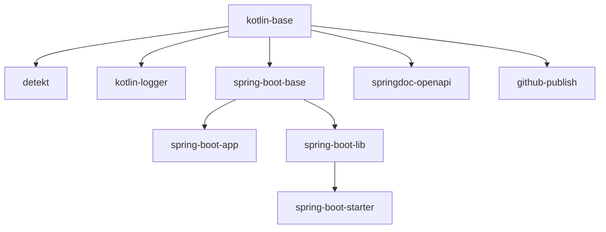

# GCX Shared Code Monorepo

## List of Libraries

1. Base (The Base for Spring Boot Apps)
2. Test Containers 

## List of Plugins

The Plugins are structured as follows:


1. Kotlin Base 
   - For all kotlin libraries
   - It sets Java version to 17
   - Includes JUnit, AssertK and Spring MockK
2. Detekt
   - Static Code Analysis
3. Spring Boot Base
   - The base for all Spring libs
   - Include JPA
   - Spring Boot Starter Test
     - Excluding `junit-vintage-engine` and `mockito-core`
4. Spring Boot Lib
   - Base for Spring Boot Libs
   - Disables `tasks.bootJar`
   - Enables `tasks.jar`
5. Spring Boot Starter
   - Base for all Spring Boot Starters
   - Includes Auto Configuration dependencies
6. Spring Boot App
   - Base for your Spring application
   - Includes 
     - spring-boot-starter-security
     - spring-boot-starter-web
     - spring-boot-starter-validation
     - spring-boot-starter-actuator
     - jackson-module-kotlin")
7. Kotlin Logger
   - Automatically includes default logging config into your project after build
   - Includes kotlin logging
     - io.github.microutils:kotlin-logging-jvm
     - ch.qos.logback.contrib:logback-json-classic
     - ch.qos.logback.contrib:logback-jackson
9. SpringDoc OpenAPI
   - Includes `springdoc-openapi` dependencies
10. Publish
    - Internal plugin to publish libs and plugins into this repository

## How to add to your project?

1. Go to https://github.com/settings/tokens/new
2. Create a Github Token with `read:packages` permission
3. Copy the token
4. Create or edit the file `~/.gradle/gradle.properties` in your machine. You need at least the following two lines:
    ```kotlin
    github.user=<your github.com username for grandcentrix>
    github.token=<the token as copied>
    ```
5. Go back to Github and enable SSO for GCX-SI (by clicking “Authorize” next to GCX-SI and follow the instructions)
6. Add the package repository:
    ```kotlin
    repositories {
        maven {
            name = "GitHubPackages"
            url = uri("https://maven.pkg.github.com/GCX-SI/gcx-common-libs")
            credentials {
                username = project.findProperty("github.user") as String? ?: System.getenv("GITHUB_USER")
                password = project.findProperty("github.token") as String? ?: System.getenv("GITHUB_TOKEN")
            }
        }
    }
    ```
   > Unfortunately this has to be added for each repository. So if you have already added the ACM repo, you still need to add the common libs repository. 
7. Add the desired dependencies and plugins:
    ```kotlin
    plugins {
        id("net.grandcentrix.plugin.spring-boot-app")
        id("net.grandcentrix.plugin.detekt")
        id("net.grandcentrix.plugin.kotlin-logger")
    }
   
    dependencies {
        implementation("net.grandcentrix.component:base")
    }
    ```

## Publishing

`./gradlew publish -Pversion=[version]` 